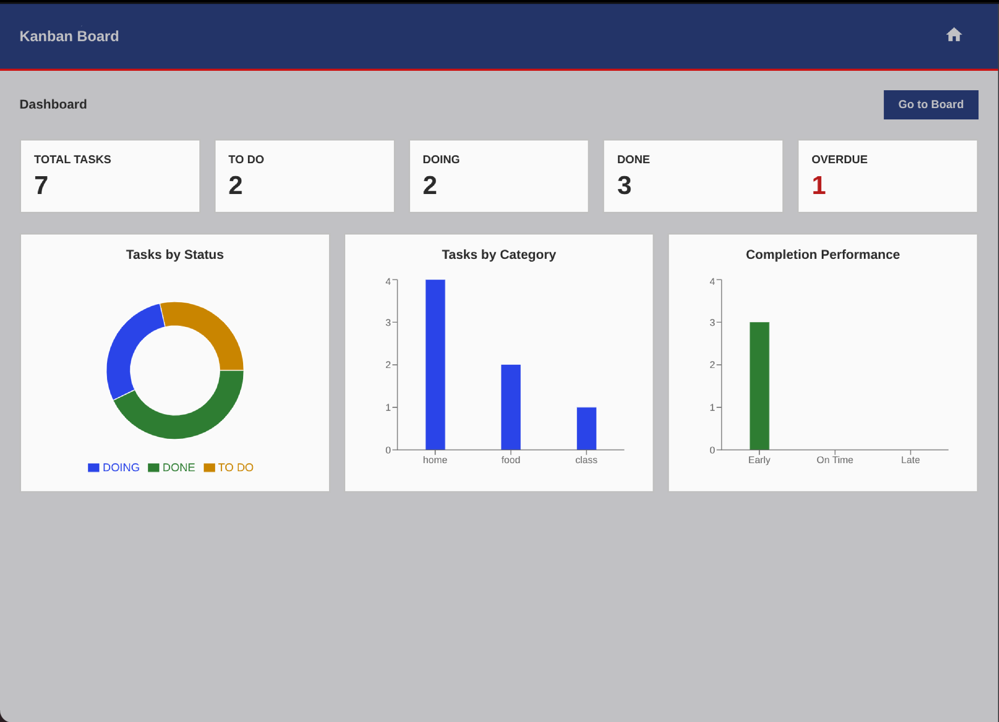
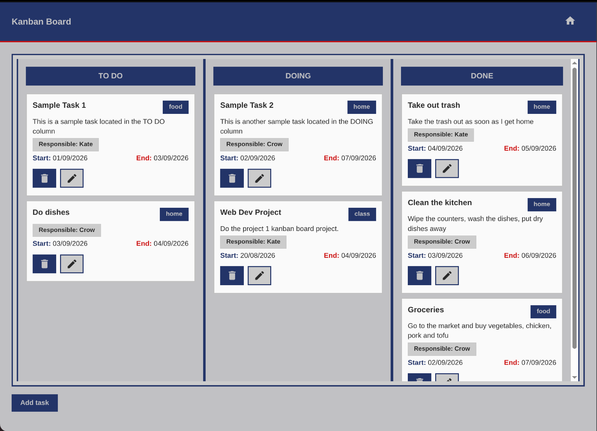
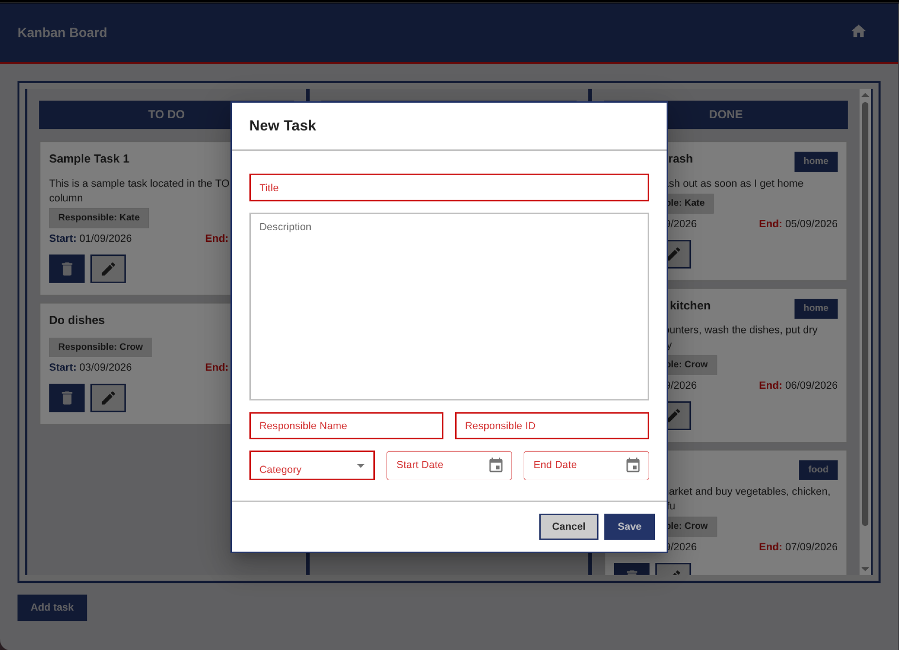
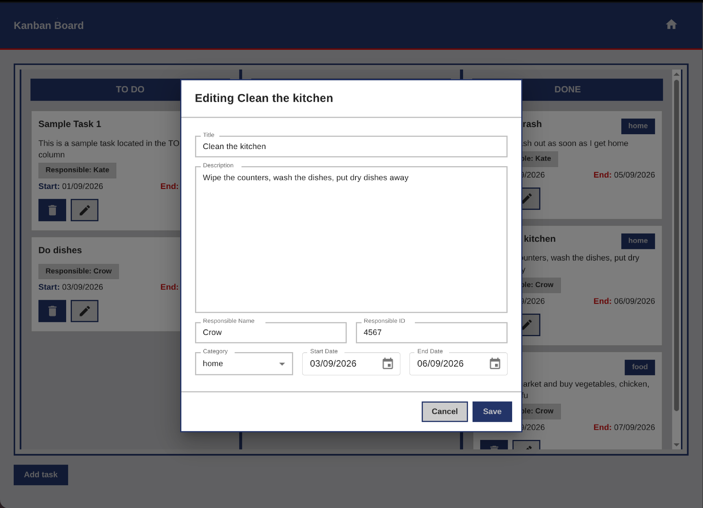
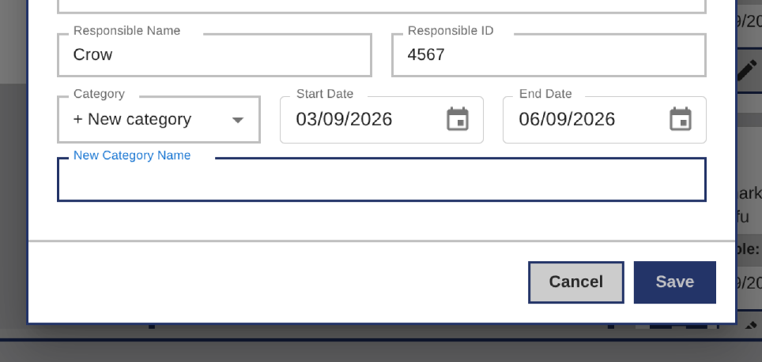

# Kanban Board with Dashboard

A small task management app built with React and Vite for CSX4107 Project 1. Tasks sit on a three column kanban board and a dashboard gives a quick overview of the workload. Everything runs in the browser with no backend, and all data is kept in local storage so it persists after a page refresh.

Live demo: https://kari-nami.github.io/csx4107-project1-kanban-board/

## Features

- Three column board: TO DO, DOING and DONE
- Drag and drop to move tasks between columns
- Create, edit and delete tasks
- Task details: title, description, category, responsible person, start date, due date and complete date
- Pick an existing category or add a new one while creating or editing a task
- The complete date is set automatically when a task is moved to DONE
- Dashboard with summary cards, a status chart, a category chart and a completion performance chart
- Tasks and categories are saved in LocalStorage so they persist between page reloads

## Screenshots

### Dashboard



### Kanban board



### Creating New Task



### Editing Existing Task



### Adding new category



## Getting started

Use the live demo above, or run it locally:

```bash
npm install
npm run dev
```

## How to use

1. Open the board and press **Add task** to create a task. Fill in the details and save.
2. Drag a task to another column to change its status. Dropping it in DONE records the complete date.
3. Use the edit and delete buttons on a task card to change or remove it.
4. When editing or creating a new task, choose "add new category" to create a new category
5. Press the home button in the top bar to switch to the dashboard and view statistics.

To start fresh, clear the site data in your browser and the default tasks come back.

## Members

- Sai Aike Shwe Tun Aung
- Ekaterina Kazakova
